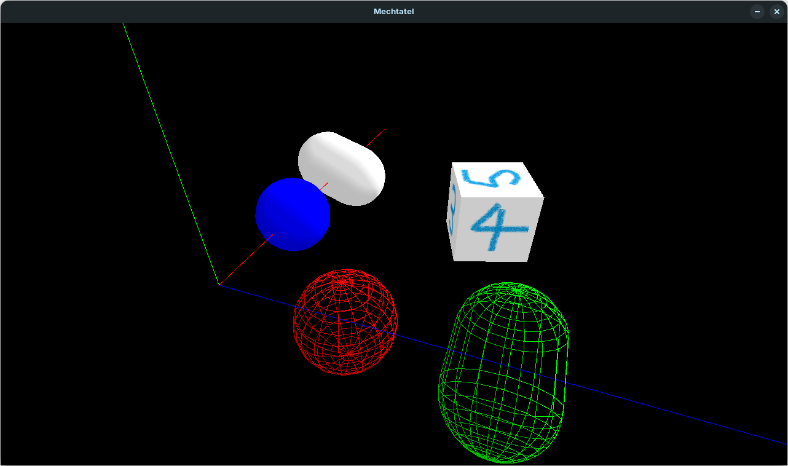
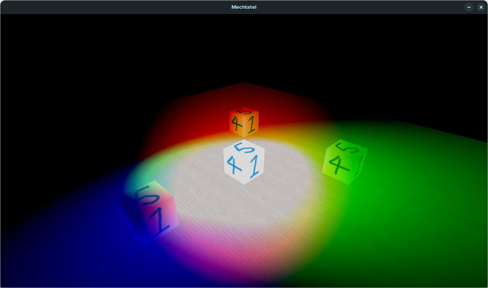
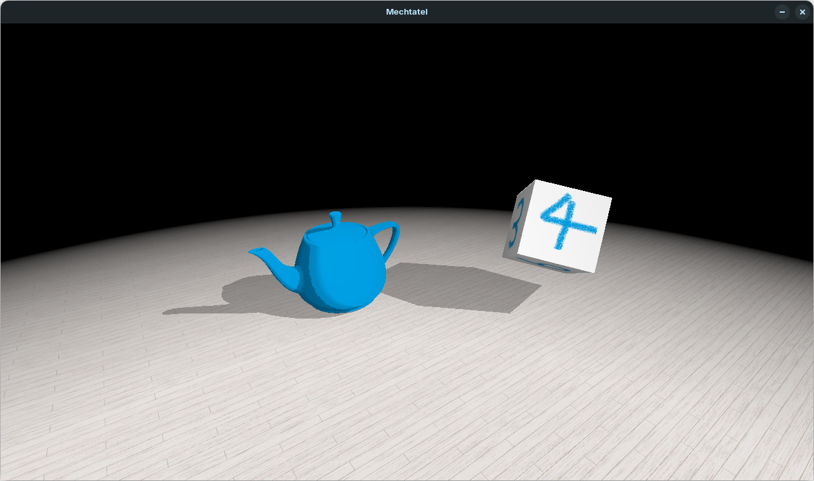
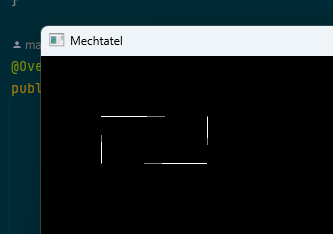
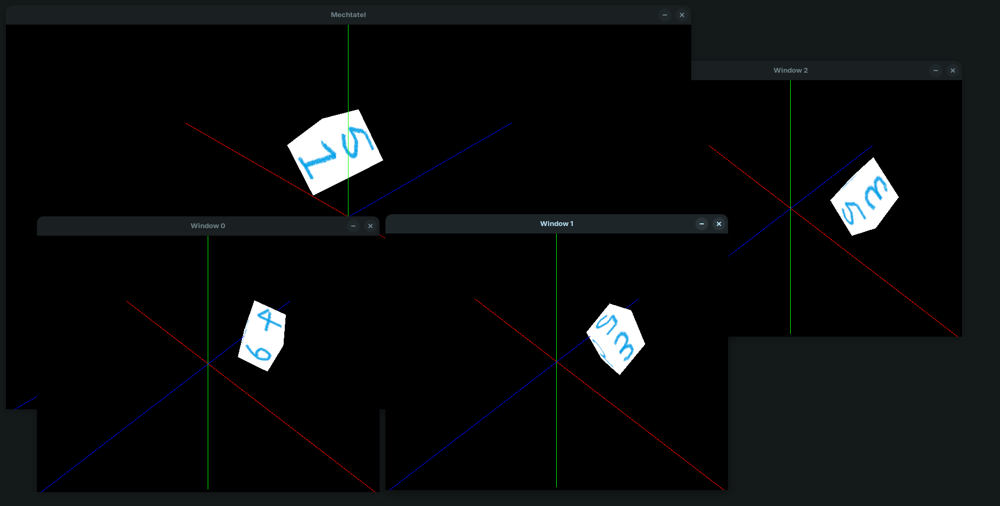

<!-- @formatter:off -->

# Mechtatel

Mechtatel (ru: Мечтатель en: Dreamer)

> Мечтай до тех пор, пока не узнаешь, что давно пора повзрослеть и бросить эту фигню.

## Overview

This project aims to create a Vulkan-based game engine in Java with the help of [LWJGL](https://www.lwjgl.org/).
It's still far from what you call a game engine, but I'll keep on developing little by little in my free time.
Leave a star in this repo if you like it!

*Mechtatel* is a word that means "Dreamer" in Russian.
It's by far the best word to describe me, only dreaming and being far from any achivements.
God knows if I could complete this work by the time you'd think I'm no more...

## Motivation

It's been years since I came up with an idea like "Isn't it great if I could create a game engine and build my own game upon it?"
If you just want to create a game, then you should take advantage of the great game engines such as Unity and Unreal Engine.
As for me, I simply love to write code, and want to develop a game starting from the lowest level possible.

I've been a big fan of a good old game called [X operations](https://rucsgames.net/se/xops/).
It's a shooter game developed for Windows and first released in 2003.
I always have this game in mind when developing the Mechtatel engine, thinking about what kind of features will be required to develop a modernized cross-platform version of it.
Its somewhat cheap taste of 20-year-old gameplay still captivates me. 

## Requirements

- Java ≥ 25
- Vulkan ≥ 1.3

### Supported platforms

| Platform    | Tested |
|-------------|--------|
| Linux x64   | Yes    |
| Linux arm64 | No     |
| Windows x64 | Yes    |
| macOS arm64 | No     |

Support for Linux arm64 is partly tested on a `g5g.xlarge` instance of AWS EC2.

## Try it out!

### Core

```xml
<dependencies>
    <dependency>
        <groupId>io.github.maeda6uiui</groupId>
        <artifactId>mechtatel-core</artifactId>
        <version>0.5.0</version>
    </dependency>
    <dependency>
        <groupId>io.github.maeda6uiui</groupId>
        <artifactId>mechtatel-platform-pack-linux</artifactId>
        <version>0.5.0</version>
    </dependency>
    <dependency>
        <groupId>io.github.maeda6uiui</groupId>
        <artifactId>mechtatel-logging</artifactId>
        <version>0.5.0</version>
    </dependency>
</dependencies>
```

`mechtatel-platform-pack-linux` module loads platform-dependent dependencies for Linux x64.
You have to change it according to your target platform.

| Platform    | Module name                         |
|-------------|-------------------------------------|
| Linux x64   | mechtatel-platform-pack-linux       |
| Linux arm64 | mechtatel-platform-pack-linux-arm64 |
| Windows x64 | mechtatel-platform-pack-windows     |
| macOS arm64 | mechtatel-platform-pack-macos-arm64 |

pom.xml in the [mechtatel-hello](./Misc/mechtatel-hello) project might be a good starting point if you want to dynamically load a platform-pack module according to the target platform.

Use of `mechtatel-logging` module is optional.
It provides minimal logging functionality with Logback, which prints out logs above the INFO level to stdout.
You can overwrite it or use another logging implementation at your discretion.

### Audio

```xml
<dependencies>
    <dependency>
        <groupId>io.github.maeda6uiui</groupId>
        <artifactId>mechtatel-audio</artifactId>
        <version>0.5.0</version>
    </dependency>
    <dependency>
        <groupId>io.github.maeda6uiui</groupId>
        <artifactId>mechtatel-audio-natives-linux</artifactId>
        <version>0.5.0</version>
    </dependency>
</dependencies>
```

`mechtatel-audio` module provides audio playback functionality for various audio formats including MP3 and FLAC.
The core part is written in Rust and `mechtatel-audio` works as an interface to the underlying native library.
It can be used independently from `mechtatel-core`.

As with the `mechtatel-core` module, you have to add a platform-dependent module to dependencies according to the target platform.

| Platform    | Module name                         |
|-------------|-------------------------------------|
| Linux x64   | mechtatel-audio-natives-linux       |
| Linux arm64 | mechtatel-audio-natives-linux-arm64 |
| Windows x64 | mechtatel-audio-natives-windows     |
| macOS arm64 | mechtatel-audio-natives-macos-arm64 |

## Documentation

Unfortunately, there are no elaborate documents for this project so far.
However, you could still check out the [test code](./mechtatel-core/src/test/java/com/github/maeda6uiui/mechtatel/) and hopefully get to know what Mechtatel has to offer!

## Settings

You can change some values pertaining to this engine via settings.json.
Its default location is "./Mechtatel/settings.json", but you could rename it as per your need.

Below is an excerpt from a test code.
You pass the filepath of the setting file to the `MttSettings.load` method.

```java
public SpotlightTest(MttSettings settings) {
    super(settings);
    this.run();
}

public static void main(String[] args) {
    MttSettings
            .load("./Mechtatel/settings.json")
            .ifPresentOrElse(
                    SpotlightTest::new,
                    () -> logger.error("Failed to load settings")
            );
}
```

## Todo

- Reflection mapping

## Special thanks to

- [Vulkan Tutorial](https://vulkan-tutorial.com/)
- [Vulkan-Tutorial-Java](https://github.com/Naitsirc98/Vulkan-Tutorial-Java)
- [3D Game Development with LWJGL 3](https://ahbejarano.gitbook.io/lwjglgamedev/)

## Screenshots

### Some basic primitives



### Physics objects

https://github.com/user-attachments/assets/30f6bce4-7e85-4cd7-8bf0-4d9db438533e

### Spotlights



### Shadow mapping



### Skeletal animation

https://github.com/user-attachments/assets/65d0cb8f-ee49-4daa-aa64-b8614ce935ed

### ImGui



### Rendering to multiple windows



### Water effects

#### Still water

https://github.com/user-attachments/assets/ec4396bb-3c64-47f4-8a52-a9c9bc8c6602

#### Rough water

Click the following image to watch the demo on YouTube.

[](https://youtu.be/Io_jJE6zkI0)
