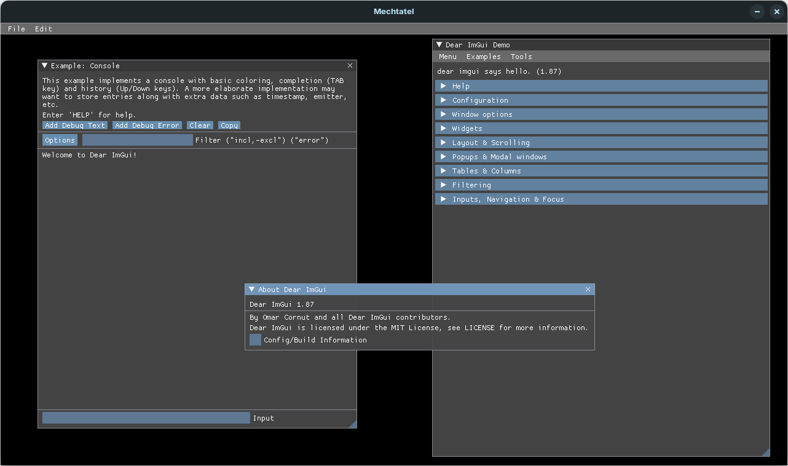

<!-- @formatter:off -->

# Mechtatel

Mechtatel (ru: Мечтатель en: Dreamer)

> Мечтай до тех пор, пока не узнаешь, что давно пора повзрослеть и бросить эту фигню.

## Overview

This project aims to create a Vulkan-based game engine in Java with help of [LWJGL](https://www.lwjgl.org/).
It's still far from what you call a game engine, but I'll keep on developing little by little in my free time.
Leave a star in this repo if you like it!

Unfortunately, there are no elaborate documents for this project so far.
However, you could check out the [test code](./mechtatel-core/src/test/java/com/github/maeda6uiui/mechtatel/) and hopefully get to learn what Mechtatel has to offer!

Note that this project is currently under development and is subject to drastic change.

## Message from developer 

It's been years since I came up with an idea like "Isn't it great if I could create a game engine and build my own game upon it?"
If you just want to create a game, then you should take advantage of the great game engines such as Unity and Unreal Engine.
As for me, I simply love to write code, and want to develop a game starting from the lowest level possible.

*Mechtatel* is a word that means "Dreamer" in Russian.
It's by far the best word to describe me, only dreaming and being far from any achivements.
God knows if I could complete this work by the time you'd think I'm no more...

## Try it out

### Core

```xml
<dependencies>
    <dependency>
        <groupId>io.github.maeda6uiui</groupId>
        <artifactId>mechtatel-core</artifactId>
        <version>0.2.0</version>
    </dependency>
    <dependency>
        <groupId>io.github.maeda6uiui</groupId>
        <artifactId>mechtatel-logging</artifactId>
        <version>0.2.0</version>
    </dependency>
</dependencies>
```

Use of `mechtatel-logging` module is optional.
It provides minimal logging functionality with Logback, which prints out logs above the INFO level to stdout.
You can overwrite it or use another logging implementation at your discretion.

### Audio

```xml
<dependencies>
    <dependency>
        <groupId>io.github.maeda6uiui</groupId>
        <artifactId>mechtatel-audio</artifactId>
        <version>0.2.0</version>
    </dependency>
</dependencies>
```

`mechtatel-audio` module provides audio playback functionality for various audio formats including MP3 and FLAC.
The core part is written in Rust and `mechtatel-audio` works as an interface to the underlying native library.
It can be used independently from `mechtatel-core`, but keep in mind that it currently supports only Linux x64 and Windows x64 because it's not written in pure Java.

## Currently working on

## Todo

- Reflection mapping
- Normal mapping
- Water surface

## Special thanks to

- [Vulkan Tutorial](https://vulkan-tutorial.com/)
- [Vulkan-Tutorial-Java](https://github.com/Naitsirc98/Vulkan-Tutorial-Java)
- [3D Game Development with LWJGL 3](https://ahbejarano.gitbook.io/lwjglgamedev/)

## Screenshots

Some basic primitives


Physics objects


Spotlights


Shadow mapping


Skeletal animation


ImGui



Rendering to multiple windows


