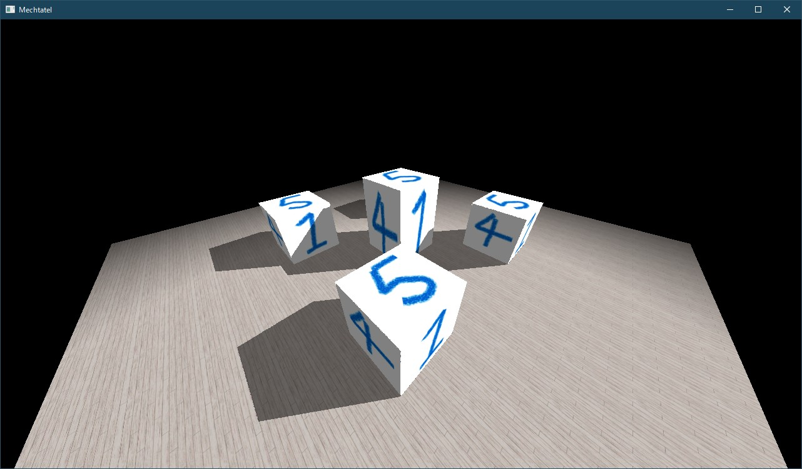

# Mechtatel

Mechtatel (露: Мечтатель 英: Dreamer)

> Мечтай до тех пор, пока не узнаешь, что давно пора повзрослеть и бросить эту фигню.

> Dream until you realize that it's high time you grew up and gave up this garbage.

## 概要

Javaでゲームエンジンを作ることを目標としているプロジェクトです。

[LWJGL](https://www.lwjgl.org/)でVulkanを使用して開発を進めています。
開発が進めばいつかOpenGLにも対応するかもしれません。

現状はまだゲームエンジンと呼べるような代物ではありませんが、気力と時間があるときに少しずつ開発を進めていきたいと思っています。

## 開発者のコメント

「自作のゲームエンジンを作りたい」と思ってから何年も経ち、思いつきでコードを書いては捨て、書いては捨て、そんなことを繰り返しながら、ただのゴミを生産してきた人生です。

ゲームを作りたいだけならば、UnityやUnreal Engineといった偉大なゲームエンジンを使用するべきだと思います。

しかし自分は、単純にコードを書くのが好きで、可能な限り低水準な部分からゲームを作成してみたいのです。
どんなゲームを作りたいのかもまだ定まっていないので、とりあえず汎用的に使えるゲームエンジンを開発すればいいのではないか、という理由もあります。

プロジェクト名の*Mechtatel*というのはロシア語で「夢を見る人」(Dreamer)という意味です。
いつまでも夢を見ていて結局何も成し遂げられない、そんな自分の現状を端的に表現する単語です。

結局自分が死ぬまで何も成し遂げられないかもしれませんし、あるいは何か芸術的なゴミを生み出すことができるかもしれません。
「この人を応援したい！」とか思うような頭のおかしい人は、Starでも付けていってください...。

## 依存関係

./Mechtatel/Binディレクトリ配下に以下のバイナリを配置します。

- [shaderc](https://github.com/google/shaderc)
- [Libbulletjme](https://github.com/stephengold/Libbulletjme)

## Todoリスト

- [ ] テキストボックスの実装
- [ ] BD1ファイルの読込機能の実装
- [ ] シャドウマッピングの改善
- [ ] フレームバッファの実装
  - [ ] 一連のレンダリング結果をテクスチャとして別のレンダリングで使用
  - [ ] レンダリング結果を画像として保存する機能の実装
- [ ] MP3とWAVの再生機能の実装(2Dサウンド)

## 進捗報告

### 2023-03-21

リストボックスを実装しました。


### 2023-03-12

塗りつぶした四角形の描画機能を実装しました。
今までありそうで地味に実装していなかった機能です。


塗りつぶした四角形を用いて縦向きのスクロールバーを実装しました。


どのくらいスクロールされたのか取得するメソッドはこれから用意します。

### 2023-02-23

テキストの描画をちょっと改善して、ボタンの枠も描画するようにしました。
マウスをクリックしたときの動作はコールバックで指定します。


チェックボックスも実装しました。
左側のボックスをクリックすると選択状態と非選択状態を切り替えることができます。


### 2023-02-05

ボタンのつもりです。
カーソルを合わせると色が変化します。


クリックしたときの動作はまだ実装できていません。
最初はボタンの外枠も描画するようにしていましたが、自分の力量不足でただ鬱陶しいだけになってしまったので、文字だけ描画するようにしました。

### 2023-01-29


この画像の撮影のためにスポットライトを複数設置しようとしたら、なぜか最初に設定したライトしか反映されず、バリデーションエラーも特に出ていなかったので、原因を突き止めるのに時間がかかってしまいました。
原因としては、VkDescriptorSetLayoutBinding.descriptorCountにセットする値が間違っていたのと、余計なVkWriteDescriptorSetを作成してvkUpdateDescriptorSetsを実行していたことでした。

その他地味につまづいたところとしては、Bulletではモデル対モデルの当たり判定はできないというところです。
まあこれは考えてみれば(たぶん)当たり前の話で、任意の形をしたモデル同士の当たり判定を現実的な時間内で行うアルゴリズムなんてないですよね。

当たり判定についてはとりあえずこのくらいにしておいて、次はボタンやスクロールバーといったGUIコンポーネントを実装していきたいと思います。

### 2023-01-28

久しぶりの更新です。

カプセルとボックスの当たり判定も実装しました。
ゲームを作る上で必要な当たり判定はこれで一通り実装できたと思います。


### 2022-10-09

球と平面の衝突判定を実装しました。
物理演算にはBulletを使用しています。
画像だけだとイマイチわかりにくいですね...。


### 2022-10-08

音声ファイルの再生機能を実装しました。
今のところ、サポートしているフォーマットはOGGのみです。
モノラルサウンドを使用する場合は3Dサウンドとなります。

### 2022-10-02

任意のUnicode文字を表示できるようになりました。
(表示する文字に対応しているフォントを使用する必要があります)


### 2022-10-01

まだ完全ではないですが、それっぽい描画結果を得ることができました。


まだ修正すべき点も多いですが、任意のASCII文字を表示できるようになりました。


### 2022-09-11

2D直線の描画機能を実装しました。


2Dの描画機能を一通り実装できたら、次はテキストの描画に移る予定です。
ちょっと調べてみたところ、テキストの描画はそんなに簡単ではなさそうですね...。

### 2022-08-21

カプセルの描画機能を実装しました。


キーボードでカメラを操作できる機能(`FreeCamera`)を実装しました。

### 2022-05-08

球の描画機能を実装しました。


### 2022-05-06

直線の描画機能を実装しました。


関係ないですが、開発環境を再びWindowsに戻しました。

### 2022-05-01

キーボード入力とマウス入力を実装しました。

### 2021-12-12

開発環境をUbuntuに移行しました。
Ubuntuでも問題なく動作しているように見えます。


ただ、Windowsで開発していたときには出なかったValidation Errorが出ます。

```
Validation Error: [ VUID-VkPipelineLayoutCreateInfo-pSetLayouts-00288 ] Object 0: handle = 0x7f82a0d39be0, type = VK_OBJECT_TYPE_DEVICE; | MessageID = 0xef93e10c | vkCreatePipelineLayout(): max per-stage uniform buffer bindings count (66) exceeds device maxPerStageDescriptorUniformBuffers limit (64). The Vulkan spec states: The total number of descriptors of the type VK_DESCRIPTOR_TYPE_UNIFORM_BUFFER and VK_DESCRIPTOR_TYPE_UNIFORM_BUFFER_DYNAMIC accessible to any shader stage across all elements of pSetLayouts must be less than or equal to VkPhysicalDeviceLimits::maxPerStageDescriptorUniformBuffers (https://vulkan.lunarg.com/doc/view/1.2.198.0/linux/1.2-extensions/vkspec.html#VUID-VkPipelineLayoutCreateInfo-pSetLayouts-00288)
```

スポットライトでUBOを64個割り当てているので、それが上限値を超えていますよ、というエラーだと思います。
カメラで1個、ライティング情報で1個、スポットライトで64個なので、エラーメッセージに出力されている数(66)とも一致します。
試しにスポットライトに割り当てるUBOを32個にしたら、このValidation Errorは出なくなりました。

Windowsで開発しているときにはこのValidation Errorは出なかったはずなんですが、原因はよくわかりません。

このエラーを無視しても動作に問題はなさそうなので、とりあえずはこのまま進めていきたいと思います。

### 2021-11-17

基礎的なシャドウマッピングは実装できました。




色付きの影を出すこともできます。


### 2021-11-14

ライトから見たDepthは正しいようだ。


こんなコードを書いてデバッグを試みた。

```glsl
vec4 shadowCoords=biasMat*shadowInfos[0].lightProj*shadowInfos[0].lightView*modelMat*vec4(position,1.0);
float shadowDepth=texture(sampler2D(shadowDepthTextures[0],textureSampler),shadowCoords.xy).r;

outColor=vec4(shadowCoords.z-shadowDepth);
```


なんか影らしきものは出ている。

shadowCoords.zが現在処理している座標のライトから見たDepthで、shadowDepthは先に取得しておいたライトから見たDepthになっている。
shadowCoords.z > shadowDepthなら、その座標には影がかかっているということになる。
逆に、shadowCoords.z = shadowDepthとなっている場合、その座標には影はかからない。

つまり上の画像で、黒くなっている部分(shadowCoords.z - shadowDepth = 0)には影がかからず、灰色になっている部分には影がかかるはず...。

ちゃんと灰色になっているから、影がかかるはずなんだが...。
平面の一部が影がかかる場所ではないのに灰色になっているのも少し気になる。

---

何とかできました。影が荒いのは許してください。


Fragment Shaderで使用しているbiasMatが原因でした。

修正後のbiasMatは以下のとおり。

```glsl
mat4 biasMat;
biasMat[0]=vec4(0.5,0.0,0.0,0.0);
biasMat[1]=vec4(0.0,0.5,0.0,0.0);
biasMat[2]=vec4(0.0,0.0,1.0,0.0);
biasMat[3]=vec4(0.5,0.5,0.0,1.0);
```

~~詳しい原因究明はまた今度...~~

### 2021-11-13

近いところまで来ている気がするけど、どこが間違っているのかわからない。


遅延レンダリング(Deferred Rendering)を採用している関係で、今のやり方がそもそも間違っているのかもしれない。
以前にOpenGLで前方レンダリング(Forward Rendering)を用いてシャドウマッピングを実装したときには、ここまで苦労しなかったような気がする...。

これを何とかしてクリアしないと、(自分の心情的に)先に進めない。

### 2021-11-03

シャドウマッピングがなかなかうまくいかない...。
惜しいところまでは来ている気がするけど。

### 2021-10-06

点光源(ポイントライト)を実装しました。


複数のポイントライトを設置するとこんな感じになります。


スポットライトのコードを流用することで比較的簡単に実装できました。

また、同じモデルを何度も読み込むのは無駄なので、モデルの複製(同じモデルの読み込みは一度のみ、テクスチャは共有)を行う機能も実装しました。

### 2021-10-03

スポットライトを実装しました。


Post Processing用のNaborを接続するのは比較的簡単にできるようになりました。
ユーザが書くコードとしては、以下のような感じになります。

```java
var ppNaborNames = new ArrayList<String>();
ppNaborNames.add("spotlight");
this.createPostProcessingNabors(ppNaborNames);
```

上の画像ではSpotlight用のNaborしか使用していないのでこのようなコードになりますが、たとえば、Parallel LightをかけてからFogをかけるなら、

```java
var ppNaborNames = new ArrayList<String>();
ppNaborNames.add("parallel_light");
ppNaborNames.add("fog");
this.createPostProcessingNabors(ppNaborNames);
```

というようにすればいいだけです。

次は点光源とシャドウマッピングを実装していきたいと思います。

### 2021-09-26

フォグを実装しました。


### 2021-09-25

シェーディングを実装しました。


### 2021-09-20

Nabor (露: Набор 英: Kit)という概念を導入してみました。
NaborはRender PassやGraphics Pipelineといったレンダリングに必要なデータ一式をもちます。

現在はGBufferNaborとPresentNaborの二つのNaborがあります。
GBufferNaborを用いて色(Albedo)や深度(Depth)を出力し、その画像をPresentNaborのシェーダに渡して最終的な描画結果を画面に出力します。
これが効率的なやり方なのかどうかはわかりませんが、この方法を用いれば、Naborを複数個繋げて色々なエフェクトをかけることができます。(たぶん)

GBufferNaborから出力される内容としては、以下のようになります。

#### Albedo


#### Depth


#### Position


#### Normal


あまり詳しく理解していないのですが、これらの出力を利用して、遅延シェーディング(Deferred Shading)というのを行いたいと思っています。

### 2021-09-05

ノードを連結して描画結果を自由にカスタマイズできる、みたいなことをやりたい。
イメージとしては、Blenderのノードビュー(?)みたいな感じです。


VulkanのSubpassあたりを使えば実装できるのかなと考えていますが、Render PassとかSubpassとか、まだあんまりはっきりと理解できていないので、ここからしばらくは彷徨うことになりそうです。

### 2021-08-28

そこはかとなくいい感じのものができました。


描画結果はこれまでと同じですが、それを実現するコードの方に進歩があったと思います。
ユーザはMechtatelクラスを継承して自身のクラスを作成し、そのinit()、dispose()、reshape()、update()という四つのメソッド内に処理を記述します。

```java
package com.github.maeda6uiui.mechtatel;

import com.github.maeda6uiui.mechtatel.core.Mechtatel;
import com.github.maeda6uiui.mechtatel.core.MttSettings;
import com.github.maeda6uiui.mechtatel.core.component.Model3D;

import java.io.IOException;

public class MyMechtatel extends Mechtatel {
    public MyMechtatel(MttSettings settings) {
        super(settings);
    }

    public static void main(String[] args) {
        MttSettings settings;
        //Load settings from a JSON file
        try {
            settings = new MttSettings("./Mechtatel/Setting/settings.json");
        }
        //If the program fails to load the JSON file, then use the default settings
        catch (IOException e) {
            settings = new MttSettings();
        }

        new MyMechtatel(settings);
    }

    private Model3D model;

    @Override
    public void init() {
        model = this.createModel3D("./Mechtatel/Model/Cube/cube.obj");
    }

    @Override
    public void dispose() {
        //Components are automatically cleaned up, so you don't have to explicitly clean up the component.
        //model.cleanup();
    }

    @Override
    public void reshape(int width, int height) {

    }

    @Override
    public void update() {

    }
}
```

現在使用しているのはVulkanですが、同じようにすれば、OpenGLに対する抽象化も提供することができるはずです。(たぶん)

### 2021-08-25

Specフォルダ内のREADME.mdを更新しただけですが、もう一度プログラムの作成に進みます。(仕様書の作成とは...)

当面の予定ですが、まずは図形を描画するためのComponent周りを実装していきます。
その後、基本的な描画機能を提供する標準シェーダを追加していきます。

うまくいかなかったらそのときまた考えます。

### 2021-08-21

複数のモデルを表示することができました。


このあたりで一度立ち止まって、仕様書の作成に戻りたいと思います。

### 2021-08-18

3Dモデル(Utah Teapot)を表示できました。
これで[チュートリアル](https://github.com/Naitsirc98/Vulkan-Tutorial-Java)の内容を一通り実装したことになります。
このチュートリアルなしではここまでたどり着けなかったので、感謝しかないです。


ところで、複数のテクスチャを表示する方法がわかりません。
自分が変な操作をしているのが原因なのは明確ですが、Validation Errorが出ます。
複数のテクスチャを使用するモデルを表示したいので、この点に関して調べる必要がありますね。

#### 追記

複数のテクスチャを使用するモデルを表示できました。


テクスチャごとにDescriptor Setを作成するという手法を取りましたが、これが正しいのかどうかはよくわかりません。

### 2021-08-14

テクスチャを表示できました。


現状、Vulkan関連のコードはほとんど[ここ](https://github.com/Naitsirc98/Vulkan-Tutorial-Java)からコピーしている感じです。
一つのクラスに全部のコードを入れたくないので、可能な限り細かく複数のクラスに分けています。

### 2021-08-09

ようやく三角形を描画するところまで来ました。


### 2021-07-18

雑な仕様書を作成しています。

Vulkanを明確に理解しているわけではないので、Mechtatelをどんな感じの仕様にすればいいのか、正直よくわかりません。
特に、Vulkanと深く関わる低水準な部分については、今の自分の経験と知識では、これ以上仕様を詰めることは難しいと思います。

そこで、勉強も兼ねて、少しずつプログラムを作成していきたいと思います。
まずは(仕様書で言うところの)Coreの部分を実装していき、それがうまくいくようであれば、基本的なComponentの実装に進みたいと思います。

もちろん、(今までのように)うまくいかなくて匙を投げるようなことがあるかもしれませんが、結局のところ、あれはだめだ、これもだめだ、というふうに試行錯誤を繰り返すことによって、徐々に形の定まった、洗練された~~ゴミ~~作品が出来上がっていくはずなので、まあ、気長に構えて進めていこうと思います。

### 2021-07-04

過去数年の失敗を鑑みて、先に仕様書を作成することにします。

これまでは、思いついたものをそのまま作っていったので、ある程度作業が進んでから、「あれ、これじゃうまくいかないんじゃないか」みたいな感じになって、そのコード(あるいはプロジェクトそのもの)を放棄するということが多発していました。

この反省を活かし、細部までとは言わずとも、大雑把に全体像がつかめるくらいの仕様書は作成するべきだと考えました。

仕様書はMarkdown形式で作成し、Specフォルダ配下に置いていきます。

