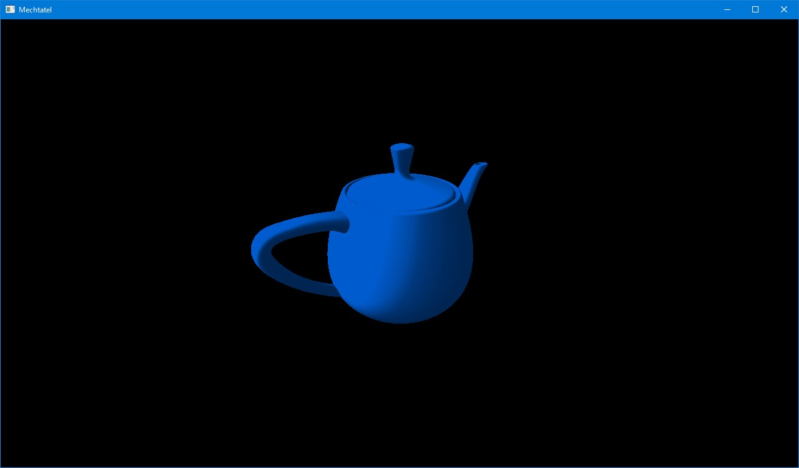

# Mechtatel

Mechtatel (露: Мечтатель 英: Dreamer)

## 概要

「自作のゲームエンジンを作りたい」と思ってから何年も経ち、思いつきでコードを書いては捨て、書いては捨て、そんなことを繰り返しながら、ただのゴミを生産してきた人生です。

ゲームを作りたいだけならば、UnityやUnreal Engineを使用するべきだと思います。
しかし、自分は単純にコードを書くのが好きで、可能な限り低水準な部分から、ゲームを作成してみたいのです。

*Mechtatel*というのはロシア語で「夢を見る人」(Dreamer)という意味です。いつまでも夢を見ていて結局何も成し遂げられない、そんな自分の現状を端的に表現する単語です。
なぜロシア語なのかというと、自分がロシアオタク(にわか)だからというだけで、それ以上の理由は特にありません。

結局自分が死ぬまで何も成し遂げられないかもしれませんし、あるいは何か芸術的なゴミを生み出すことができるかもしれません。
時間があるときに少しずつ作業を進めていきたいと思っていますので、「この人を応援したい！」とか思うような頭のおかしい人は、Starでも付けていってください...。

## 方向性

- Java
- LWJGL
- Vulkan
- (OpenGL)

## 報告

### 2021-10-06

点光源(ポイントライト)を実装しました。


複数のポイントライトを設置するとこんな感じになります。


スポットライトのコードを流用することで比較的簡単に実装できました。

### 2021-10-03

スポットライトを実装しました。


Post Processing用のNaborを接続するのは比較的簡単にできるようになりました。
ユーザが書くコードとしては、以下のような感じになります。

```java
var ppNaborNames = new ArrayList<String>();
ppNaborNames.add("spotlight");
this.createPostProcessingNabors(ppNaborNames);
```

上の画像ではSpotlight用のNaborしか使用していないのでこのようなコードになりますが、たとえば、Parallel LightをかけてからFogをかけるなら、

```java
var ppNaborNames = new ArrayList<String>();
ppNaborNames.add("parallel_light");
ppNaborNames.add("fog");
this.createPostProcessingNabors(ppNaborNames);
```

というようにすればいいだけです。

次は点光源とシャドウマッピングを実装していきたいと思います。

### 2021-09-26

フォグを実装しました。


### 2021-09-25

シェーディングを実装しました。



### 2021-09-20

Nabor (露: Набор 英: Kit)という概念を導入してみました。
NaborはRender PassやGraphics Pipelineといったレンダリングに必要なデータ一式をもちます。

現在はGBufferNaborとPresentNaborの二つのNaborがあります。
GBufferNaborを用いて色(Albedo)や深度(Depth)を出力し、その画像をPresentNaborのシェーダに渡して最終的な描画結果を画面に出力します。
これが効率的なやり方なのかどうかはわかりませんが、この方法を用いれば、Naborを複数個繋げて色々なエフェクトをかけることができます。(たぶん)

GBufferNaborから出力される内容としては、以下のようになります。

#### Albedo


#### Depth


#### Position


#### Normal


あまり詳しく理解していないのですが、これらの出力を利用して、遅延シェーディング(Deferred Shading)というのを行いたいと思っています。

### 2021-09-05

ノードを連結して描画結果を自由にカスタマイズできる、みたいなことをやりたい。
イメージとしては、Blenderのノードビュー(?)みたいな感じです。


VulkanのSubpassあたりを使えば実装できるのかなと考えていますが、Render PassとかSubpassとか、まだあんまりはっきりと理解できていないので、ここからしばらくは彷徨うことになりそうです。

### 2021-08-28

そこはかとなくいい感じのものができました。


描画結果はこれまでと同じですが、それを実現するコードの方に進歩があったと思います。
ユーザはMechtatelクラスを継承して自身のクラスを作成し、そのinit()、dispose()、reshape()、update()という四つのメソッド内に処理を記述します。

```java
package com.github.maeda6uiui.mechtatel;

import com.github.maeda6uiui.mechtatel.core.Mechtatel;
import com.github.maeda6uiui.mechtatel.core.MttSettings;
import com.github.maeda6uiui.mechtatel.core.component.Model3D;

import java.io.IOException;

public class MyMechtatel extends Mechtatel {
    public MyMechtatel(MttSettings settings) {
        super(settings);
    }

    public static void main(String[] args) {
        MttSettings settings;
        //Load settings from a JSON file
        try {
            settings = new MttSettings("./Mechtatel/Setting/settings.json");
        }
        //If the program fails to load the JSON file, then use the default settings
        catch (IOException e) {
            settings = new MttSettings();
        }

        new MyMechtatel(settings);
    }

    private Model3D model;

    @Override
    public void init() {
        model = this.createModel3D("./Mechtatel/Model/Cube/cube.obj");
    }

    @Override
    public void dispose() {
        //Components are automatically cleaned up, so you don't have to explicitly clean up the component.
        //model.cleanup();
    }

    @Override
    public void reshape(int width, int height) {

    }

    @Override
    public void update() {

    }
}
```

現在使用しているのはVulkanですが、同じようにすれば、OpenGLに対する抽象化も提供することができるはずです。(たぶん)

### 2021-08-25

Specフォルダ内のREADME.mdを更新しただけですが、もう一度プログラムの作成に進みます。(仕様書の作成とは...)

当面の予定ですが、まずは図形を描画するためのComponent周りを実装していきます。
その後、基本的な描画機能を提供する標準シェーダを追加していきます。

うまくいかなかったらそのときまた考えます。

### 2021-08-21

複数のモデルを表示することができました。


このあたりで一度立ち止まって、仕様書の作成に戻りたいと思います。

### 2021-08-18

3Dモデル(Utah Teapot)を表示できました。
これで[チュートリアル](https://github.com/Naitsirc98/Vulkan-Tutorial-Java)の内容を一通り実装したことになります。
このチュートリアルなしではここまでたどり着けなかったので、感謝しかないです。


ところで、複数のテクスチャを表示する方法がわかりません。
自分が変な操作をしているのが原因なのは明確ですが、Validation Errorが出ます。
複数のテクスチャを使用するモデルを表示したいので、この点に関して調べる必要がありますね。

#### 追記

複数のテクスチャを使用するモデルを表示できました。


テクスチャごとにDescriptor Setを作成するという手法を取りましたが、これが正しいのかどうかはよくわかりません。

### 2021-08-14

テクスチャを表示できました。


現状、Vulkan関連のコードはほとんど[ここ](https://github.com/Naitsirc98/Vulkan-Tutorial-Java)からコピーしている感じです。
一つのクラスに全部のコードを入れたくないので、可能な限り細かく複数のクラスに分けています。

### 2021-08-09

ようやく三角形を描画するところまで来ました。


### 2021-07-18

雑な仕様書を作成しています。

Vulkanを明確に理解しているわけではないので、Mechtatelをどんな感じの仕様にすればいいのか、正直よくわかりません。
特に、Vulkanと深く関わる低水準な部分については、今の自分の経験と知識では、これ以上仕様を詰めることは難しいと思います。

そこで、勉強も兼ねて、少しずつプログラムを作成していきたいと思います。
まずは(仕様書で言うところの)Coreの部分を実装していき、それがうまくいくようであれば、基本的なComponentの実装に進みたいと思います。

もちろん、(今までのように)うまくいかなくて匙を投げるようなことがあるかもしれませんが、結局のところ、あれはだめだ、これもだめだ、というふうに試行錯誤を繰り返すことによって、徐々に形の定まった、洗練された~~ゴミ~~作品が出来上がっていくはずなので、まあ、気長に構えて進めていこうと思います。

### 2021-07-04

過去数年の失敗を鑑みて、先に仕様書を作成することにします。

これまでは、思いついたものをそのまま作っていったので、ある程度作業が進んでから、「あれ、これじゃうまくいかないんじゃないか」みたいな感じになって、そのコード(あるいはプロジェクトそのもの)を放棄するということが多発していました。

この反省を活かし、細部までとは言わずとも、大雑把に全体像がつかめるくらいの仕様書は作成するべきだと考えました。

仕様書はMarkdown形式で作成し、Specフォルダ配下に置いていきます。

